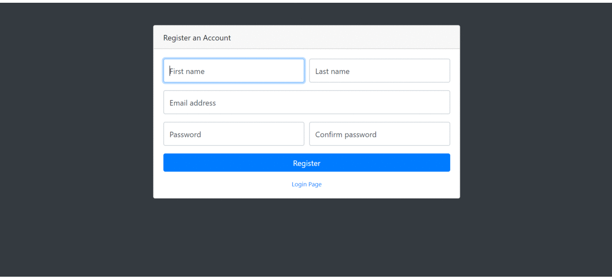

# Things Organizer

<div align="center">
  
  <p>
    Simple and "lightweight" web application for organizing that disaster or room/garage/lab (I suppose) we all have.
  </p>
</div>

---

## Build status

|                                        Master                                        |                                          Development                                           |
| :----------------------------------------------------------------------------------: | :--------------------------------------------------------------------------------------------: |
|  |  |

---

## Features

- Open Source :sparkles:
- Python based application. :snake:
- Search items :mag:
- Print labels for items, categories and storages. :printer:
- Report generation. :chart_with_upwards_trend:
  - CSV
  - TXT
- User authentication. :lock:

---

## Background

The idea :bulb: came to my mind one day I was looking a SOC board like the Raspberry Pi and I could not find it due to the mess I had, all boards, cables :electric_plug:, equipment :hammer_and_wrench:, etc. where all around in different boxes :package: and different places all over my house :house: from my room lab to the garage.

So I came up with the idea of develop a server using [Flask](http://flask.pocoo.org/) and [some other](./requirements.txt) Python libraries.

Now I can:

- Search the for item I'm looking for on the application and it will tell me where I have it stored.

- Print the label for that item or even for the storage boxes and bags I have on different locations(**e.g.** Garage, Room, etc.).

---

## Documentation

If you want to know more in depth what each single file does go to the application [documentation](./documentation/).

This tool is using the bootstrap template from @BlackrockDigital
[Start Bootstrap - SB Admin](https://github.com/BlackrockDigital/startbootstrap-sb-admin)

---

## Running the application

- Clone this repository. :dancers:

  ```shell
  git clone https://github.com/yeyeto2788/Things-Organizer.git
  ```

- Create the virtual environment.

  ```console
  python3 -m virtualenv venv
  source ./venv/bin/activate
  ```

- Install dependencies. :computer:

  ```console
  pip3 install -r requirements.txt
  ```

- Finally run the application. :snake:

  ```console
  python manage.py runserver
  ```

---

<!-- Frequently asked questions -->

## FAQ :raising_hand_woman::raising_hand_man:

No frequently asked question yet. :neutral_face:

---

<!-- Support -->

## Support :mechanic:

Reach out to me at one of the following places!

- Website at [juanbiondi.com](https://www.juanbiondi.com)
- Create an [issue](https://github.com/yeyeto2788/Things-Organizer/issues/new/choose) on this repository. :pirate_flag:
- Send me an [email](mailto:jebp.freelance@gmail.com) :email:

---

<!-- Contributing -->

## Contributing

Contributions are what make the open source community such an amazing place to be learn, inspire, and create. Any contributions you make are **greatly appreciated**.

1. Fork the Project
2. Create your Feature Branch (`git checkout -b feature/super_awesome_feature`)
3. Commit your Changes (`git commit -m 'Add some awesome feature'`)
4. Push to the Branch (`git push origin feature/super_awesome_feature`)
5. Open a Pull Request
