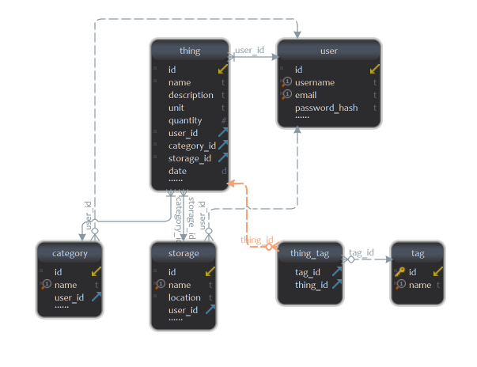

# Things Organizer

Simple and "lightweight" web application for organizing that disaster or room/garage/lab
(I suppose) we all have.

<div style="text-align:center">

</div>

The idea came from a day I was looking a SOC board like the Raspberry Pi and I could not find it
due to the mess I had, all boards, cables, equipment, etc. where all around in different boxes and
different places all over my house from my room lab to the garage.


So I came up with the idea of develop a server using [Flask](http://flask.pocoo.org/) and
[some other](/requirements.txt) Python libraries.


Now I can search the thing I'm looking for on the application and it will tell me where I have
stored that thing. I can also print the label for that item or even for the storage boxes and bags
I have on different locations(**e.g.** Garage, Room, etc.).

This tool is using the bootstrap template from @BlackrockDigital
[Start Bootstrap - SB Admin](https://github.com/BlackrockDigital/startbootstrap-sb-admin)

## Project Structure

Below you can see a basic layout of the repository and a quick and short description of each folder.

```
Main Repository Folder(Thing-Organizer)
        └── Doc - Folder(All documentation related files)
        └── Scripts - Folder(Some scripts for automate some things.)
        └── Module - Folder(things_organizer)
        |       └── api - Module(API for the application)
        |       └── data - Folder(Database and reports storage)
        |       └── db - Module(Models of Database)
        |       └── reports - Module(Report generator modules)
        |       └── static - Folder(Static files to be served)
        |       └── templates - Folder(Flask templates to be used.)
        |       └── test - Folder(All application tests)
        |       └── forms.py
        |       └── utils.py
        |       └── views.py
        └── run_app.py
```

If you want to know more in depth what each single file does go to the
application [documentation](Doc/project_documentation/things_organizer).

## DataBase information.

#### Naming convention for tables and columns

For tables in the database we have use the Pascal Case
(a.k.a [Upper Camel Case](https://en.wikipedia.org/wiki/Camel_case)) and the tables on the database
are the following:

* **thing**
    * id `int`
    * name `str`
    * description `str`
    * unit `str`
    * quantity `int`
    * storage_id `int`
    * category_id `int`
    * user_id `int`
    * date `date`
* **category**
    * id `int`
    * name `str`
    * user_id `int`
* **storage**
    * id  `int`
    * name `str`
    * location `str`
    * user_id `int`
* **tag**
    * id `int`
    * name `str`
* **thing_tag**
    * thing_id `int`
    * tag_id `int`
* **user**
    * id `int`
    * username `str`
    * email `str`
    * password_hash `str`

#### Database Schema:

In the image below you can see the relationship of each table created on the database.

<p align="center">

</p>
<p align="center">Image done with <a href="https://www.dbschema.com/download.html">dbschema</a>.
</p>
<p align="center">Pending to use <a href="https://github.com/schemacrawler/SchemaCrawler">SchemaCrawler</a> since it is open
source.</p>

As you can see in the image above there are some uniques columns on tables, which are the following:

<center>
  <table>
    <tr>
      <th>Table</th>
      <th>Column</th>
    </tr>
    <tr>
      <td><code>storage</code></td>
      <td>name</td>
    </tr>
    <tr>
      <td><code>category</code></td>
      <td>name</td>
    </tr>
    <tr>
      <td><code>user</code></td>
      <td>email</td>
    </tr>
    <tr>
      <td><code>user</code></td>
      <td>username</td>
    </tr>
  </table>
</center>

#### Other information of the DataBase

Taking into account that some errors may arise I have decided to create a
different DataBase for logging.

All logs are accessible from the route `<ip:port>/logs`
**e.g.** [http://127.0.0.1/8080/logs](http://127.0.0.1/8080/logs)

## TODO:
 - [ ] Scripts for automate some repetitive work.
   <ul><li> - [ ] Add more functionalities on the `run_app.py`.</li>
   </ul>
 - [ ] Features to add:
   <li> - [x] Generate reports.
     <ul><li> - [ ] PDF</li>
     <li> - [x] CSV</li>
     <li> - [x] TXT</li>
     </ul>
   </li>
   </ul>
 - [ ] Documentation.
  <ul>
    <li> - [ ] `run_app.py` options.</li>
    <li> - [ ] API.</li>
  </ul>
