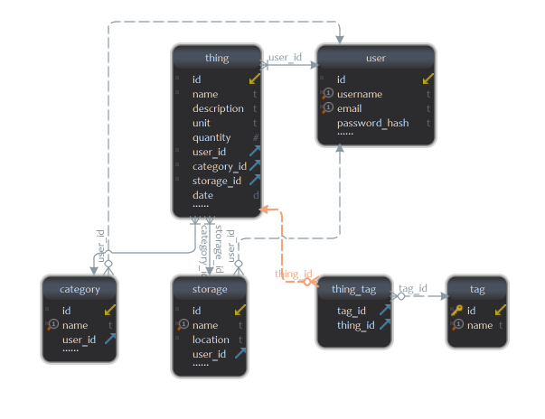

# DataBase information.

## Naming convention for tables and columns

For tables in the database we have use the Pascal Case
(a.k.a [Upper Camel Case](https://en.wikipedia.org/wiki/Camel_case)) and the tables on the database
are the following:

---

## Tables

Below you can see the database structure.

### **thing**

| Column name | Type   |
| :---------- | :----- |
| id          | `int`  |
| name        | `str`  |
| description | `str`  |
| unit        | `str`  |
| quantity    | `int`  |
| storage_id  | `int`  |
| category_id | `int`  |
| user_id     | `int`  |
| date        | `date` |

### **category**

| Column name | Type  |
| :---------- | :---- |
| id          | `int` |
| name        | `str` |
| user_id     | `int` |

### **storage**

| Column name | Type  |
| :---------- | :---- |
| id          | `int` |
| name        | `str` |
| location    | `str` |
| user_id     | `int` |

### **tag**

| Column name | Type  |
| :---------- | :---- |
| id          | `int` |
| name        | `str` |

### **thing_tag**

| Column name | Type  |
| :---------- | :---- |
| thing_id    | `int` |
| tag_id      | `int` |

### **user**

| Column name   | Type  |
| :------------ | :---- |
| id            | `int` |
| username      | `str` |
| email         | `str` |
| password_hash | `str` |

---

## Database Schema:

In the image below you can see the relationship of each table created on the database.

Image done with <a href="https://www.dbschema.com/download.html">dbschema</a>.

As you can see in the image above there are some unique columns on tables, which are the following:

| Table    | Column   |
| :------- | :------- |
| storage  | name     |
| category | name     |
| user     | email    |
| user     | username |

---

## Other information of the DataBase

Taking into account that some errors may arise I have decided to create a
different DataBase for logging.

All logs are accessible from the route `<ip:port>/logs`
**e.g.** [http://127.0.0.1/8080/logs](http://127.0.0.1/8080/logs)
